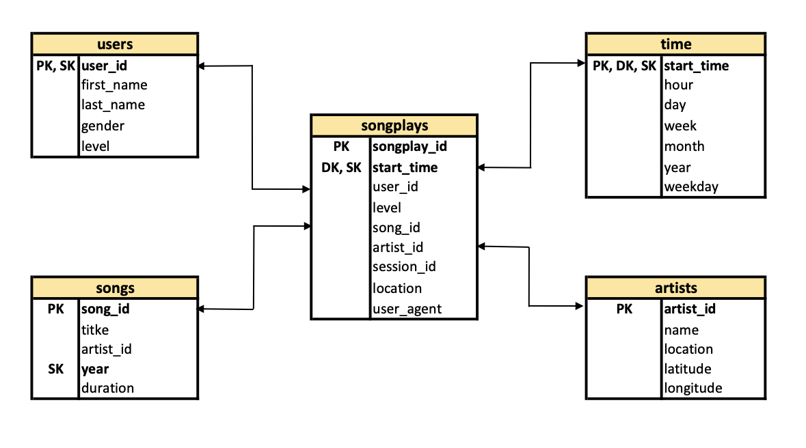

## data_modeling_ETL_redshift

A music streaming startup, Sparkify, has grown their user base and song database and want to move their processes and data onto the cloud. 
Their data resides in S3, in a directory of JSON logs on user activity on the app, as well as a directory with JSON metadata on the songs in their app.

For this project, we will build an ETL pipeline that extracts their data from S3, stages them in Redshift, and transforms data into a set of 
dimensional tables for their analytics team to work on finding insights to support decision making.

### Requirements for running
- Python3 
- AWS account
- Configured aws credentials file (https://docs.aws.amazon.com/cli/latest/userguide/cli-chap-configure.html)

### Project structure explanation
```
data_modeling_ETL_redshift
│   README.md                              # Project description
|   dwh_blank.cfg                          # Blank configuration file
|   requirements.txt                       # Python dependencies
│   create_cluster_IaC.py                  # Cluster creation script
|   create_tables.py                       # Schema creation script
|   delete_cluster_IaC.py                  # Cluster deletion script
|   etl.py                                 # ETL script
|   sql_queries.py                         # Definition of all sql queries
|   redshift_cluster_test_queries.ipynb    # Notebook to test if ETL pipeline was successfully created
```

### Database schema


### Instructions for running locally
Clone repository to local machine
```
git clone https://github.com/vilandao/data_modeling_ETL_redshift.git
```

Change directory to local repository
```
cd redshift-data-modeling
```

Create python virtual environment
```
python3 -m venv venv             # create virtualenv
source venv/bin/activate         # activate virtualenv
pip install -r requirements.txt  # install requirements
```

Create Redshift cluster
```
python create_cluster_IaC.py # take note of Endpoint, Role_ARN and Security_Group output
```

Edit dwh-blank.cfg file
```
HOST=<ENTER REDSHIFT ENDPOINT>   # paste Endpoint output from script above
ARN='<ENTER REDSHIFT ROLE ARN>'  # paste Role_ARN from script above (leave quotes)
SG_ID=<ENTER SECURITY GROUP ID>  # paste sg_id from output above
```

Create schema
```
python create_tables.py
```

Execute ETL
```
python etl.py # load data into staging tables, transform and load data to fact and dim tables
```

Check results

```
jupyter notebook  # launch jupyter notebook app

# Navigate to redshift_cluster_test_queries.ipynb and run the notebook to check if Redshift and sparkify database work properly
```

Delete cluster
```
python delete_cluster_IaC.py
```


